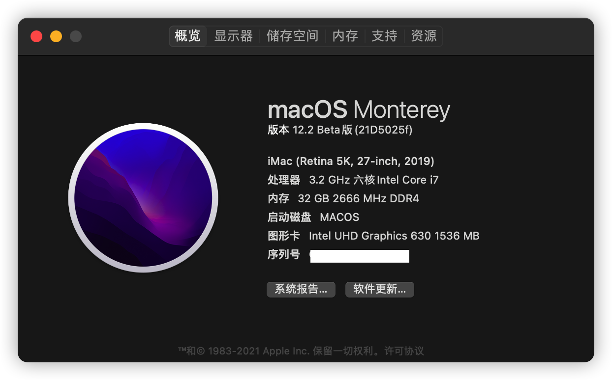

# GIGABYTE-B360M_AORUS_PRO-8700-Hackintosh-OpenCore-EFI

技嘉 B360M AORUS PRO / i7-8700 UHD630 / macOS 12 Monterey / macOS 11 BigSur / 黑苹果 OpenCore EFI / GIGABYTE B360M AORUS PRO Hackintosh OpenCore EFI

## 更新

已升级 macOS 12 Monterey Beta，并且驱动 intel Wi-Fi和蓝牙 AC9560。详见：[macOS 12 Monterey 驱动Wifi和蓝牙 AC9560](https://x.medemede.cn/archives/m-a-c-o-s--1-2--m-o-n-t-e-r-e-y--qu-dong-w-i-f-i-he-lan-ya--a-c-9-5-6-0)

以后主要更新适配 macOS 12。

## 使用方法

此EFI已尽量保持纯净，删减了官方模版中大量无用的样例，没有添加任何怪异的补丁，只添加必要的配置。OC最近几个版本的配置项变动非常频繁，有许多配置项的增删，不建议直接把旧的config.pdist复制过来用。

### macOS 11 and lower

OC版本：OC-0.6.9-RELEASE

1. 从 `EFI/OC/` 文件夹中选择合适的配置文件并将其重命名为 `config.pdist` 即可
2. 默认开启了日志输出，系统安装、调试完成后可关闭日志（见文末）

### macOS 12

暂时不建议日常使用！

OC版本：OC-0.7.0-RELEASE

因为涉及多个Kext的变化，所以从上个版本的EFI中独立了出来，不再提供多个版本的config，请按需手动修改：

- 若需要AWAC补丁，则将 ACPI->Add->SSDT-AWAC-DISABLE.aml->Enabled 设为true
- 若不需要Wifi，则删除 AirportItlwm.kext，并删除config中的相应配置
- 若不需要蓝牙BT，则删除 BlueToolFixup.kext和IntelBluetoothFirmware.kext，并删除config中相应的配置
- 默认开启了日志输出，系统安装、调试完成后可关闭日志（见文末）

## 文件详情

- `config-NoAWAC-WiFiBT.plist`: 无AWAC补丁，有Wifi和蓝牙kext（默认为该配置文件）
- `config-AWAC-WiFiBT.plist`: 有通用AWAC补丁，有Wifi和蓝牙kext
- `config-NoAWAC-NoWiFiBT.plist`: 无AWAC补丁，无Wifi和蓝牙kext
- `config-AWAC-NoWiFiBT.plist`: 有通用AWAC补丁，无Wifi和蓝牙kext

**建议 GIGABYTE B360M AORUS PRO 使用“无AWAC补丁 ”的版本，原因如下文2。**

1. 使用 [AirportItlwm.kext](https://github.com/OpenIntelWireless/itlwm) 和 [IntelBluetoothFirmware](https://github.com/OpenIntelWireless/IntelBluetoothFirmware) 来驱动CNVi无线网卡蓝牙模块 —— AC9560。
2. **为什么删除SSDT-AWAC.aml**：几乎网上所有教程都说300系主板一定需要该补丁，但我在 `技嘉 B360M AORUS PRO` 通过SSDTime发现其并没有AWAC时钟，不需要该补丁。而且更重要的是AWAC补丁会导致BIOS时间不更新，进而造成Win时间不走（非时区问题）。如果之前使用过AWAC，而且出现了win下时间不走的问题，只能扣主板电池重置BIOS。
3. 通过删除config中的 `PciRoot(0x0)/Pci(0x2,0x0)`下的`AAPL,slot-name`,实现了HD630 4k HEVC加速。

## 硬件配置

- 已通过启动参数`-wegnoegpu`**屏蔽独显，只驱动核显，使用主板接口输出**
- 强烈建议**使用DP输出**
- 引导： OpenCore RELEASE
- 系统： macOS 12 Monterey
- CPU： i7-8700 睿频正常
- 集显：UHD630 1536MB 支持4k ~~HEVC加速~~(VideoProc在Monterey中崩溃无法打开)
- 内存：4*8G 2666MHZ 正常
- 有线网卡：正常
- 无线网卡+蓝牙：AC9560 CNVi模块，正常
- 音频：正常
- USB：正常
- 睡眠：正常

## BIOS 设置

参考：[intel-bios-settings](https://dortania.github.io/OpenCore-Install-Guide/config.plist/coffee-lake.html#intel-bios-settings)

### Disable

- Fast Boot
- Secure Boot
- Serial/COM Port
- Parallel Port
- VT-d (can be enabled if you set DisableIoMapper to YES)
- CSM
- Thunderbolt(For initial install, as Thunderbolt can cause issues if not setup correctly)
- Intel SGX
- Intel Platform Trust
- CFG Lock (MSR 0xE2 write protection)(This must be off, if you can't find the option then enable both AppleCpuPmCfgLock and AppleXcpmCfgLock under Kernel -> Quirks. Your hack will not boot with CFG-Lock enabled)

### Enable

- VT-x
- Above 4G decoding
- Hyper-Threading
- Execute Disable Bit
- EHCI/XHCI Hand-off
- OS type: Windows 8.1/10 UEFI Mode
- DVMT Pre-Allocated(iGPU Memory): 64MB
- SATA Mode: AHCI

> boot item: BOOT/BOOTx64.efi

## 关闭 SIP 和 authenticated-root (可选)

见：[如何正确关闭macOS 11和12的SIP以及只读文件系统authenticated-root](https://x.medemede.cn/archives/ru-he-zheng-que-guan-bi-m-a-c-o-s--1-1-he-1-2-de-s-i-p-yi-ji-zhi-du-wen-jian-xi-tong)

## 关闭所有日志输出

- Misc -> Debug -> AppleDebug = NO
- Misc -> Debug -> ApplePanic = NO
- Misc -> Debug -> Target = 0
- NVRAM -> 7C436110-AB2A-4BBB-A880-FE41995C9F82 -> boot-args: 删除 `-v debug=0x100` 等参数

## 截图

